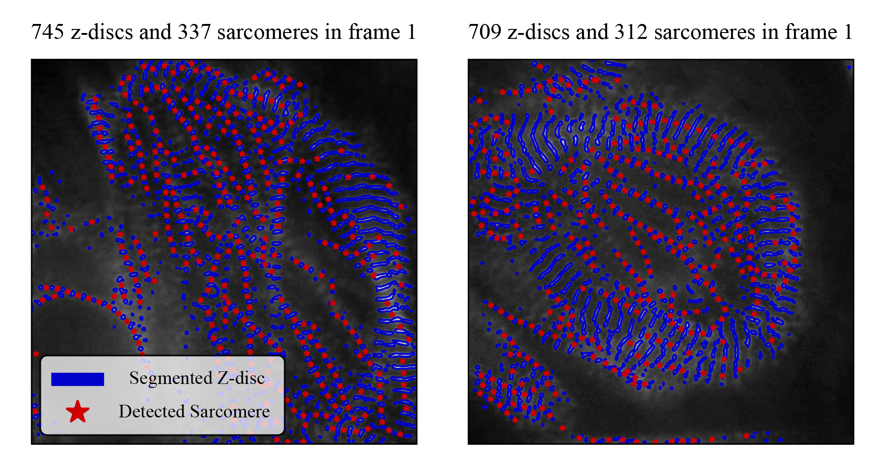

# Summary

Heart disease remains the leading cause of death worldwide [@who_cvd_fs]. In response to this societal burden, scientific funding agencies and researchers have invested significant effort into understanding and controlling the functional behavior of heart cells. In particular, there has been a recent and growing focus on engineered heart cells and tissue to both better understand the complex interactions that drive disease, and to repair the damaged heart. An important component of these endeavors is the study of human induced pluripotent stem cell-derived cardiomyocytes (hiPSC-CMs), cells sampled non-invasively from living humans, transformed into stem cells, and subsequently differentiated into cardiomyocytes, i.e., cardiac muscle cells. 
These cardiomyocytes are composed of sarcomeres, sub-cellular contractile units, that can be fluorescently labeled and visualized via z-disc proteins. One major challenge in studying hiPSC-CMs in this context is that the immaturity and structural nonlinearities (i.e., disordered sarcomere chain structure in comparison to the almost crystalline sarcomere structure of mature cardiomyocytes) of hiPSC-CMs causes significant complications for performing consistent analysis of their functional contractile characteristics. And, though multiple methods have recently been developed for analyzing images of hiPSC-CMs [@morris2020striated; @sutcliffe2018high; @pasqualini2015structural; @doi:10.1161/CIRCRESAHA.116.310363; @pasqualin2016sarcoptim; @TELLEY2006514; @gerbin2021cell], few are suitable for analyzing the asynchronous contractile behavior of beating cells [@toepfer2019sarctrack]. In our previous publication, we introduced a novel computational framework (`SarcGraph`) to perform this task, directly compared it to other methods, and demonstrated its state of the art efficacy and novel functionalities [@zhao2021sarc].

Here we introduce an open-source Python package to make the `SarcGraph` approach to performing automated quantitative analysis of information-rich movies of fluorescently labeled beating hiPSC-CMs broadly accessible. In contrast to the original version of the software released in conjunction with our previous publication [@zhao2021sarc], the updated version is better designed, more efficient, and significantly more user-friendly. In addition, there are multiple methodological and implementation updates to improve overall performance. In brief, our framework includes tools to automatically detect and track z-discs and sarcomeres in movies of beating cells, and to recover sarcomere-scale and cardiomyocyte-scale functional behavior metrics. In addition, SarcGraph includes additional functions to perform post-processing spatio-temporal analysis and data visualization to help extract rich biological information. With this further development of SarcGraph, we aim to make automated quantitative analysis of hiPSC-CMs more accessible to the broader research community. To make our framework more accessible, SarcGraph is capable of running various video and image formats and textures out of the box. And, SarcGraph can be customized and adapted by both users and future developers. In addition to the ongoing maintenance of SarcGraph by our group, we expect a continuous contribution by other researchers to improve the software. 

{width=60%}

# Statement of Need

The goal of the SarcGraph software package is to perform sarcomere segmentation, tracking, and analysis from images and movies of beating human induced pluripotent stem cell derived cardiomyocytes (hiPS-CMs). This is a challenging problem that requires specialized software for two key reasons: (1) sarcomeres are typically not imaged directly, rather their presence and geometry are inferred based on the location of labeled striations (see \autoref{fig:intro}), and (2) unlike mature cardiomyocytes, hiPSC-CMs often have a disordered structure and exhibit asynchronous contraction which necessitate specialized methods to extract meaning from these data. The target audience for this software is biomedical researchers who perform hiPSC-CM experiments that include image analysis. This software package is a complete re-write of our previous version of this software, though we encourage users to reference our previously published paper [@zhao2021sarc] for additional theoretical and practical context. As a brief note for future SarcGraph users and developers, the code is structured so that the individual steps (e.g., data import, segmentation, tracking, analysis) can be used in isolation (e.g., performing segmentation without tracking on single images) or replaced with further development (e.g., fundamentally change the segmentation algorithm but still perform downstream tracking and analysis).

# SarcGraph in Action

SarcGraph provides users with tools to process images and videos of hiPSC-CMs for z-disc and sarcomere segmentation and tracking. \autoref{fig:sample} demonstrates tracked z-discs and sarcomeres in the first frames of two videos of beating cells. For z-disc and sarcomere segmentation, we build on our previously described work [@zhao2021sarc] and also implement a more efficient sarcomere detection algorithm, detailed in [Appendix](#appendix). For tracking, we build on a previously developed Python package for particle tracking TrackPy [@allan_daniel_b_2023_7670439]. 

{width=75%}

After initial segmentation and tracking, SarcGraph offers several post-processing analysis and visualization functions. \autoref{fig:features} showcases some of these features. Notably, there are multiple demos and tutorials that further explain these capabilities in the SarcGraph repository.

![This figure presents four panels illustrating some of the post-processing features of the SarcGraph package on a sample video of hiPSC-CMs. Panel (a) displays the spatial graph visualization of the segmented z-discs and sarcomeres. Panel (b) shows the average normalized sarcomere length. Panel (c) depicts the recovered deformation gradient matrix. Finally, panel (d) shows the determinant of the recovered deformation gradient matrix over time. These results demonstrate the ability of SarcGraph to analyze sarcomere dynamics in hiPSC-CMs by showcasing some of the post-processing features of the SarcGraph package.\label{fig:features}](figures/features.png){width=95%}

To validate our methods and ensure correct implementation, we generated challenging synthetic videos with characteristics similar to beating hiPSC-CMs. We used these videos to evaluate the sarcomere detection algorithm by comparing recovered metrics to their known ground truth. \autoref{fig:validation} shows this process for one of many tested validation examples.

![This figure displays the performance of SarcGraph on a synthetically generated video designed to replicate a movie of a beating hiPSC-CM. Panel (a) shows the first frame of the video with tracked sarcomeres marked by red stars. Panel (b) compares the average normalized sarcomere length obtained from SarcGraph with the ground truth. Panel (c) compares the parameters related to average deformation obtained from SarcGraph with the ground truth. The results demonstrate the validity of the SarcGraph package in accurately analyzing sarcomere dynamics in hiPSC-CMs. As a brief note, the updated version of SarcGraph is better able to recover the ground truth from this synthetic example in comparison to the previous version of the framework [@zhao2021sarc].\label{fig:validation}](figures/validation.png){width=95%}

# SarcGraph vs. Legacy Sarc-Graph

The updated version of the SarcGraph software has the following key improvements: (1) better structure, (2) testing via PyTest, (3) error handling, (4) efficiency improvements, (5) a novel sarcomere detection algorithm, and (6) significantly improved documentation including a documented API and multiple tutorials. This new version represents not only methodological improvements, but also an essential step towards making this a tool with longevity that can reasonably be used by others. 

Highlights include a more efficient and user-friendly design, achieved through various enhancements including but not limited to a modular design (by merging eight Python files into two), improved code readability (refactoring the code and removing redundancy - reducing the lines of code from 3,094 to 2,547), and the addition of tests and error handling for a more robust experience. Efficiency improvements include the utilization of built-in NumPy functions and the introduction of a new sarcomere detection algorithm. For example, the new algorithm detects and tracks 86 sarcomeres in the synthetic image (\autoref{fig:validation}) within 8.6 seconds, compared to the previous version which takes 18.3 seconds to detect only 75 sarcomeres. In the experimental sample in \autoref{fig:sample}, left panel, the updated algorithm detects and fully tracks 329 sarcomeres in 37 seconds, while the old algorithm takes 144 seconds to track only 74 sarcomeres. In addition, SarcGraph's enhanced user-friendliness is reflected in its comprehensive documentation, which includes API details and accessible Jupyter Notebook tutorials. Additionally, the package is available on both PyPI and Conda servers for easy cross-platform installation. Furthermore, we provide guidelines for advanced users to contribute to the software by adding new features and functionality, encouraging community-driven improvements. As stated previously, these user-friendly components were not present in the legacy code.

# Current Limitations and Plans for Future Development

At present, the major limitation of SarcGraph is that it only gives reliable results for relatively high quality images. Very noisy and/or low resolution experimental images will lead to poor segmentation performance where inconsistent segmentation across frames leads to downstream failures in the tracking and analysis steps. Future development of SarcGraph will focus on both identifying sarcomeres in the presence of severe noise, and on adding functionality that can individually segment overlapping and partially occluded z-discs. Furthermore, the performance of the algorithm is sensitive to parameter settings, and while we have fine-tuned the parameters for the samples we worked with, users might need to adjust them for different samples. Future development of SarcGraph will draw from more diverse datasets to create automatic parameter tuning routines to avoid this issue. Finally, in the current version of SarcGraph, detected sarcomeres are not guaranteed to be correctly identified. Future development will be required to more robustly reject spurious sarcomeres.

# Acknowledgements

This work was made possible through the support of the Boston University David R. Dalton Career Development Professorship, the Boston University Hariri Institute Junior Faculty Fellowship, the National Science Foundation CELL-MET ERC EEC-1647837, and the American Heart Association Career Development Award 856354. This support is gratefully acknowledged.

# Appendix

## Sarcomere Detection Algorithm

In this implementation of SarcGraph, we introduce a novel and further customizable algorithm for sarcomere detection, which replaces the ghost points-based approach used in our previous work [@zhao2021sarc]. Our new method works by first constructing a spatial graph from the segmented z-discs in a given frame of the movie. In this initial spatial graph, each node represents a z-disc and each edge represents a potential sarcomere location where each node is initially connected to its three nearest neighbors. To score each edge, we define a function $\mathcal{S}_i$ that takes into account the length of the edge $l_i$, the angle between the edge and its neighboring edges $\theta_{i,j}$, the maximum allowable length for a sarcomere $l_{max}$, an initial guess for the average length of sarcomeres $l_{avg}$, and three user-defined functions $f_k$.

The scoring function is defined as:

$$ \mathcal{S}_i = \mathbb{1}_{l_i < l_{max}} \Big(\max_{j\in\{1,\dots,n_i\}} \big(c_1 \times f_1(\theta_{i,j}) + c_2 \times f_2(l_i, l_j)\big) + c_3 \times f_3(l_i, l_{avg})\Big) $$

where $n_i$ is the number of edges connected to edge $i$ and,

$$ f_1(\theta_{i,j}) = \mathbb{1}_{\theta_{i,j} \leq \pi/2} \big( 1 - \theta_{i,j} / (\pi/2) \big) ^ 2 $$
$$ f_2(l_i, l_j) = (1 + |l_j - l_i| / l_i) ^ {-1} $$
$$ f_3(l_i) = e ^ {-\pi(1 - l_i / l_{avg}) ^ 2} $$

and $c_1$, $c_2$, and $c_3$ are user-defined constants that weigh the importance of each link feature. The default values of $c_k$ and functions for $f_k$ in SarcGraph were selected to produce accurate results on all of the samples that we tested (both real and synthetic data) without an example-specific parameter tuning. However, it is possible to customize these values and functions to suit different scenarios where the defaults may not perform optimally. In future development of SarcGraph, automated parameter tuning will be implemented as needed. 

To prune this spatial graph such that only accurately detected sarcomeres remain, pruning follows three rules: (1) each node can have at most two edges, (2) the angle between edges attached to a node must be greater than a threshold $\theta_{max}$, and (3) the edge score must be greater than a threshold $s_{max}$. The new algorithm offers improved effectiveness and flexibility over the previous method and is a key component of the new SarcGraph package's sarcomere detection capabilities.

{width=95%}

# Instructions to Reproduce the Results Shown in this Paper

In this Appendix, we present the code snippets used to generate the figures in the main text. It should be noted that some minor aesthetic adjustments have been made to the figures after their initial generation using these snippets in order to enhance their visual clarity and presentation quality within the paper (e.g., moving legends or changing titles).

<pre>
**Snippet 1:** Python code snippet to generate the panels in \autoref{fig:sample}

```python
from sarcgraph.sg import SarcGraph
from sarcgraph.sg_tools import SarcGraphTools

sg = SarcGraph("results", "video")
sg_tools = SarcGraphTools("results")

_, _ = sg.sarcomere_detection("sample_file") # "samples/sample_2.avi" and "samples/sample_3.avi"
_ = sg_tools.time_series.sarcomeres_gpr()

sg_tools.visualization.zdiscs_and_sarcs(frame_num=0)
```
</pre>

<pre>
**Snippet 2:** Python code snippet to generate the panels in \autoref{fig:features}

```python
from sarcgraph.sg import SarcGraph
from sarcgraph.sg_tools import SarcGraphTools

sg = SarcGraph("results", "video")
sg_tools = SarcGraphTools("results")

_, _ = sg.sarcomere_detection("sample_file") # "samples/sample_2.avi"
_ = sg_tools.time_series.sarcomeres_gpr()
sg_tools._run_all("sample_file")

sg_tools.visualization.spatial_graph()
sg_tools.visualization.normalized_sarcs_length()
sg_tools.visualization.F()
sg_tools.visualization.J()
```
</pre>

<pre>
**Snippet 3:** Python code snippet to generate the panels in \autoref{fig:validation}

```python
import numpy as np
import matplotlib.pyplot as plt

from sarcgraph.sg import SarcGraph
from sarcgraph.sg_tools import SarcGraphTools


sg = SarcGraph("results", "video")
sg_tools = SarcGraphTools("results")
sg_tools_gt = SarcGraphTools("validation-data")

_, _ = sg.sarcomere_detection("samples/sample_1.avi")
sarcs = sg_tools.time_series.sarcomeres_gpr()
_ = sg_tools.analysis.compute_F_J()
lambdas = sg_tools.visualization.F_eigenval_animation(no_anim=True)

sarcs_gt = sg_tools_gt._load_sarcomeres_gpr()
_ = sg_tools_gt.analysis.compute_F_J()
lambdas_gt = sg_tools_gt.visualization.F_eigenval_animation(no_anim=True)

sg_tools.visualization.zdiscs_and_sarcs(frame_num=0)

fig, axs = plt.subplots(1, 2, figsize=(10, 5))
fig.subplots_adjust(wspace=0.3)
axs[0].grid('on')
axs[0].set_ylim(-0.1, 0.1)
axs[0].set_xlabel('frame')
axs[0].set_ylabel('value')
for _, data in sarcs.groupby('sarc_id')["length_norm"]:
    axs[0].plot(data.to_numpy(), linewidth=0.25, color="#942d28", alpha=0.25,)
axs[0].plot(sarcs.groupby('frame').length_norm.mean(), color="#942d28", label="mean tracked")
axs[0].plot(sarcs_gt.groupby('frame').length_norm.mean(), "--", color="#999a9d", label="mean ground truth")
axs[0].legend()

axs[1].grid('on')
axs[1].set_xlabel('frame')
axs[1].set_ylabel('value')
axs[1].plot(lambdas_gt[0, :], color="#a39d9e", label=r"$\lambda_1$ - ground truth")
axs[1].plot(lambdas[0, :], color="#831915", label=r"$\lambda_1$ - tracked")
axs[1].plot(lambdas_gt[1, :], ":", color="#182160", label=r"$\lambda_2$ - ground truth")
axs[1].plot(lambdas[1, :], "--", color="#182160", label=r"$\lambda_2$ - tracked")
axs[1].legend()
```
</pre>

# References
